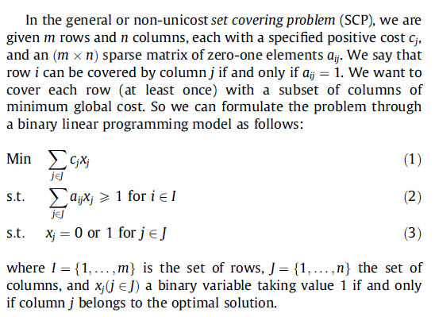
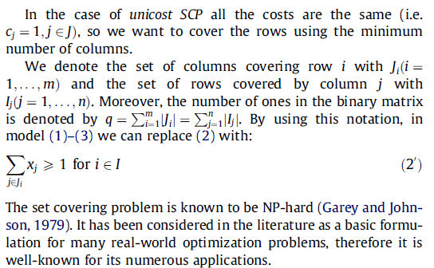

# Descripción

m = filas
n = columnas

# Una Solución y función objetivo

Una solución está dada por un vector binario de largo m que define si una columna es utilizada o no. Cada columna utilizada tiene un costo asociado. 

La función objetivo es sumar todos los costos de las columnas utilizadas

# Restricción

La restricción es que cada fila sea cubierta por al menos una columna. La combinación se da cuando se tienen un cierto número de columnas utilizadas que cubren todas las filas.